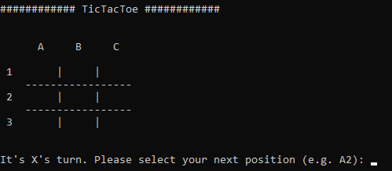

# TicTacToe

Simple command-line implementation of the game "TicTacToe" including Minimax algorithm for  computer's turns.

## Installation

You have to install the required packages defined in `requirements.txt`. Consider using a virtual environment or container environment to avoid installing the packages globally which might break other projects.

`$ pip install -r requirements.txt`

## How to play?

Start the game by typing:

`python -m tictactoe`

## Release History

* 0.1
    * ADD: Initial implementation without minimax

## Meta

Dennis Loeben – dennis@loeben.de

Distributed under the MIT license. See ``LICENSE`` for more information.

[https://github.com/dennisloe85/tictactoe]